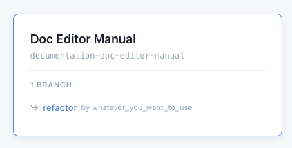

# Branch Mode

Branch mode is an advanced feature that allows you to edit and preview a parallel version of a manual that you intend to replace the original with.

Example use case:
- You have an existing manual you would like to refactor. 
- You click the Branch which will show you this dialog:

- You name the branch something like "refactor" and click [Create Branch]
- The toolbar will now show you have switched to the Branch you just created:

- If you logged out and looked at the manuals available you will see your new branch:
