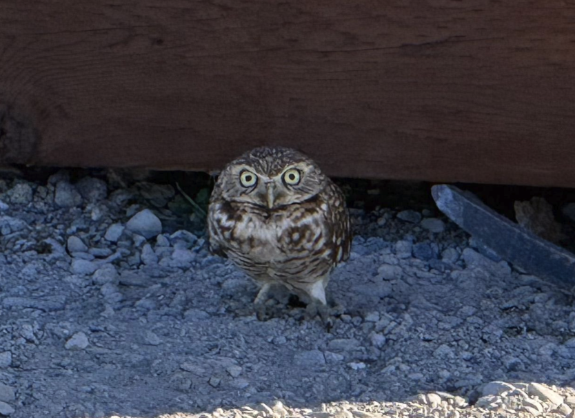

# Images

There are two quick ways to add images to the document.

1. Drag the image from your computer file explorer into the markdown editor. It will insert the image and the needed markdown.
2. Paste an image from your clipboard. If you took a screenshot on your computer and it stores the resulting image in your clipboard you can just paste in the markdown editor and it will upload that image and build the markdown code for it.

Any images added will be in the format:

``

If you use the drag and drop or paste method you don't need to worry about building the relative path, just the ALT text you want to use.
The ALT text will show up under the image as well as in the ALT attribute and Title attribute in the HTML, for example:

The markdown: ``

---

[Next Section: Branch Mode](./branch.md)

[Back to Editor Features](./index.md)