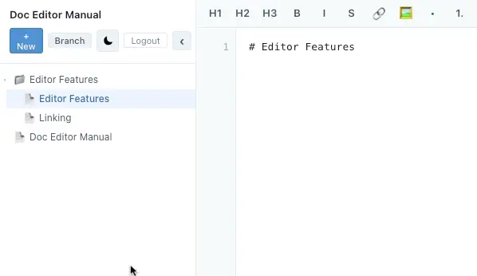

# Linking

Linking between pages is very important to group the manual together.

The manual always looks to display an `"index.md"` at the root of each directory. 

So the first page of the manual will be `/index.md`

If you have sub directories then the first page when visiting that directory will be `/<dir_name>/index.md`

To make a manual link writing markdown use the format:

`[Text of Link](Relative Path to Link)`

So to link to the root homepage you would do:

`[Home page](../index.md)`

resulting in

[Home page](../index.md)

The `../` means one level below this.

You can also make links automatically by dragging the file you want to link to from the file navigation into the editor. It will generate the markdown for the link where your cursor is:

[Next Section: Adding Images](./images.md)

[Back to Editor Features](./index.md)
