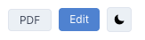
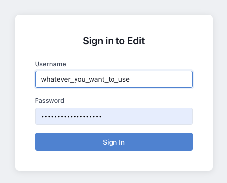

# Logging In

You can get to the editor view by clicking the Edit button on any page of the View interface:

You will be prompted to enter a username and password.

- Use ANY username you like, right now commit messages are stored in public Github repostories so if you rather not use anything identifying you can simply use "editor3" or some other annomyous username and just tell colleagues that your are editor3. Whatever you are comfortable with.
- Use the password given out.

