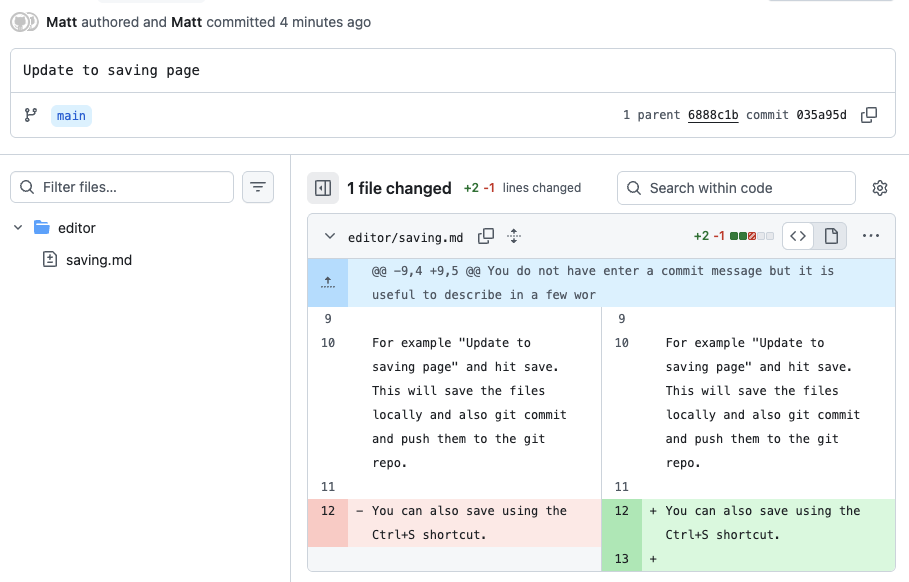

# Saving

At the bottom of the screen is the Save button and commit message.

You do not have enter a commit message but it is useful to describe in a few words what changes you did.

For example "Update to saving page" and hit save. This will save the files locally and also git commit and push them to the git repo.

You can also save using the Ctrl+S shortcut.

The commit will look like this on Github for example. The name is the name you used to log into the editor.

[Next Section: Adding Links](./linking.md)

[Back to Editor Features](./index.md)
