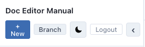
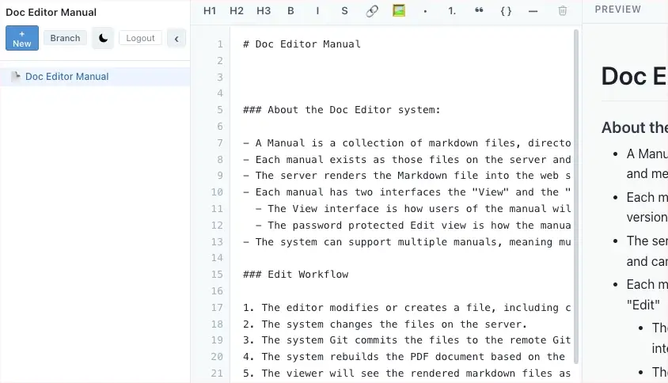

# Toolbar

There are two toolbars in the editor view.

Over the file navigation:

- The New button lets you add a new file or directory, here is an example of adding both:

- The Branch Feature
- Light / Dark Mode toggle
- Logout will log you out of the editor view and return you to "View" interface.

